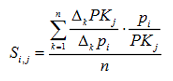
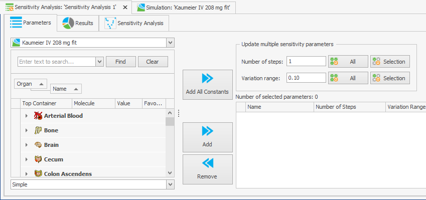
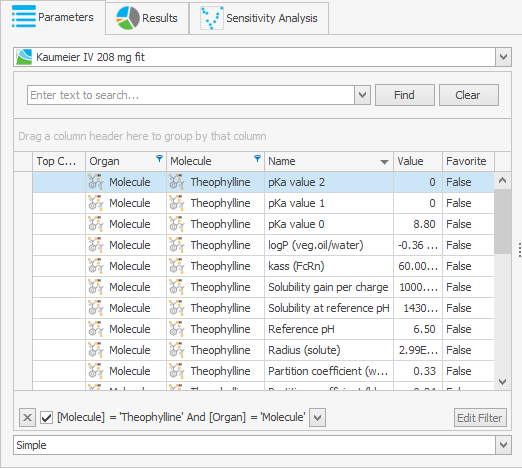
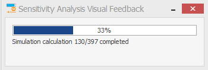
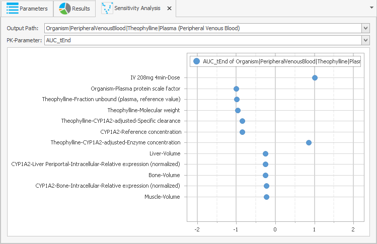
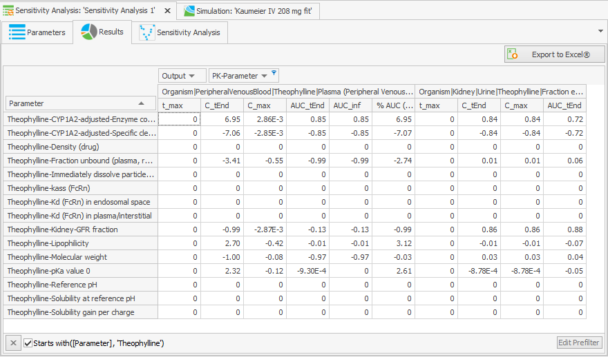

# Shared Tools - Sensitivity Analysis

The first two chapters provide a basic understanding of the Sensitivity Analysis tool.

In the following chapters you find more detailed descriptions of the features and configuration of the tool.

## Motivation‌

The models built by PK-Sim® or MoBi® depend on a lot of input parameters which are based on literature values, measurements, databases, assumptions. For a given set of input parameters a number of output curves is computed in a **simulation**.

Often, those input parameter values are not well known. If experimental data for the outputs are given and the model output does not fit the experimental data, then the values for the input parameters have to be adjusted.

Because PBPK models can be complex and contain numerous input parameters, it would be useful to know which input parameters have most impact on the output curves. The Sensitivity Analysis tool provides an answer to this question.

For a chosen simulation with selected outputs, the relative impact of selected - or all - input parameters on the PK parameters of those selected output curves is calculated and displayed. In addition, the input parameters can be ranked by their impact on a certain PK parameter of an output. This way, input parameters which have the biggest impact on e.g. the AUC of the Venous Blood concentration of a given drug or on the end value of the fraction excreted to urine.

Or from the perspective of PK parameters for outputs: It is calculated how sensitive these outputs are to changes in different input parameters. In addition, for certain PK parameter of an output the input parameters can be ranked by the sensitivity of that PK parameter on the input parameter.

The general workflow to perform a **Sensitivity Analysis** for a chosen simulation consists of the following steps:

1.  Open the simulation and define the interesting outputs in the simulation setting. 
    
2.  Create a Sensitivity Analysis for that simulation.
    
3.  Select the input parameters of interest (can be all parameters) in tab Parameters.
    
4.  If necessary adjust their variation range to appropriate values.
    
5.  Start the Sensitivity Analysis. .
    
6.  View the sensitivity rankings in tab **Sensitivity Analysis** for the outputs to identify those input parameters with the highest impact.
    
7.  View the sensitivity matrix in tab **Results** for all output-PK Parameter combinations and all input parameters for details.
    
In the following, we explain the mathematical background of the sensitivity analysis provided.

## Mathematical background‌

To calculate the sensitivity of a PK Parameter of a certain output = PKj  to an input parameter = \[ pi \]

*   the input parameter is varied/perturbed around the value in the simulation by a (small) change = \[ Δpi \] ,

*   a new simulation is performed for the changed input parameter value (all other input values remain unchanged)

*   the change of the PK Parameter \[ = ΔPKj \]  is calculated as the difference between the values in the new simulation and the original simulation.

The sensitivity for the PK Parameter to that input parameter is then calculated as the ratio of the relative change of that PK Parameter \[ = (ΔPKj) / PKj \] and the relative variation of the input parameter \[ = (Δpi) / pi \]:

Thus, the sensitivities are dimensionless quantities. As an example, a sensitivity of -1.0 implies that a 10% increase of the parameters leads to a 10% decrease of the PK parameter value, and a sensitivity of +0.5 implies that a 10% increase of the parameters leads to a 5% increase of the PK parameter value.

For reasons of numerical stability, a sensitivity is calculated as the average of several sensitivities based on different variations Δk :

The relative variations Δk are defined by multiplication of the value in the simulation with variation factors. These variation factors are defined by setting two configuration parameters "Number of Steps” \[ = n \] and “Variation Range” \[ = a \] in the following way :

For each value of k = 1 ... n, two factors are used:  and 

For the default setting n = 2 and a = 0.1, we get 4 variation factors: 1/1.1, 1/1.05, 1.05, 1.1 .

## Selection of interesting outputs for a simulation‌

Outputs of a simulation cannot be changed while creating or configuring the Sensitivity Analysis, you need to decide on the outputs before you create a Sensitivity Analysis.

To select the outputs of interest for a simulation, open that simulation and click  Define Settings and Run to display the Curve Selection Dialog.

## Creating a Sensitivity Analysis‌

To create a new Sensitivity Analysis, do one of the following

*   Mark a simulation for the Sensitivity Analysis in the Simulation Explorer and select  **Start Sensitivity Analysis ...** from the context menu.

*   Click  **Create** in the ribbon bar **Sensitivity Analysis**.

*   In the Simulation Explorer, right click the Sensitivity Analysis root node and select  **Add Sensitivity Analysis** from the context menu.

The Sensitivity Analysis view is displayed and the tab **Parameters** is opened.

For a hands on example, open the example project Theophylline.pksim5. You can open the folder with the example projects from the Start menu by selecting All Programs/Open Systems Pharmacology/PK-Sim/Examples.

In the Simulation Explorer, mark the simulation "_Kaumeier IV 208 mg fit_" and select  **Start Sensitivity Analysis ...** from the context menu.

In the Simulation Explorer, the Sensitivity Analyses are also displayed in a tree. Using the context menu, you can

*   rename a Sensitivity Analysis,

*   clone it in order to reuse the Sensitivity Analysis configuration,

*   add a Sensitivity Analysis to a Journal page,

*   delete a Sensitivity Analysis.

## Tab Parameters‌

### Selection of interesting input parameters‌
    
You can select the input parameters that are of interest to you and that you want to test in the Sensitivity Analysis in two ways:

1.  You can select all input parameters by clicking Add All Constants. Depending on the selection Simple or Advanced in the lower selection list, all parameters in the left list (not only the filtered ones) are tested in the Sensitivity Analysis. You can then remove single parameters by clicking .
    
2.  You can select specific input parameter by manually selecting them (multiple selection is possible) and clicking Add. To identify the parameters of interest it can be helpful to reorganize the parameter list view on the left and use column filters or the Find field.
    


Be aware that only independent input parameters are displayed and selectable for Sensitivity Analysis, input parameters calculated by a formula cannot be selected.

  

Sensitivities are not calculated for input parameters with initial value = 0 (to prevent accidental structural model changes during sensitivity calculations); if such parameters are selected, they are ignored and not displayed in the results.

Parameters that have a table formula are not available for selection.

In PK-Sim, parameters which should not be changed are also not available for selection. In MoBi,there are no hidden parameters; thus also those parameters could be selected for Sensitivity Analysis (especially using “Add All Constant parameters” functionality). But sensitivity calculation of those parameters does not make any sense.


You can also select another simulation at the top of this tab. If you have selected parameters already which are not available in the newly selected simulation, a warning pops up.

### Adjustment of variation range‌

See “Mathematical background” for the description of the variation concept in the calculation of sensitivities.

On the right side of the tab Parameters, you can adjust the variation parameters **Number of steps** and **Variation range**. You can change the parameters by doing one of the following:

*   change the parameters individually in each row,

*   change the parameters in the top area and set the value for all input parameters by clicking **All**,

*   change the parameters in the top area, select multiple input parameters and set the value for the selected parameters only by clicking **Selection**.


Be aware that the time to compute the Sensitivity Analysis is proportional to the number of simulations

= number of input parameters * number of steps.

So in case of performance problems, think about restricting the tested input parameters or reducing the number of steps.


## Starting Sensitivity Analysis‌

In the ribbon bar **Sensitivity Analysis**, you can start and stop the calculation of the sensitivities.

Click  **Show Visual Feedback** to see a progress bar of the simulations calculation.

After the calculation is finished, you can:

*   switch to the tab **Sensitivity Analysis** to see for a selected PK Parameter a ranking of the input parameters by their impact on that PK parameter.

*   add additional **Sensitivity Analysis** tabs for other PK parameters by clicking

Sensitivity Analysis in the ribbon bar Analyses.

*   switch to the tab **Results** to see a tabular overview of all calculated sensitivities.

## Tab Sensitivity Analysis‌

Select an output and a PK Parameter for that output. (Normalized PK parameters are not displayed, because they have the same sensitivity as the corresponding non normalized PK parameters.)

Then a list of the input parameters with the most impact on that PK Parameter is displayed ranked by their impact resp. sensitivity.

For some outputs not all PK Parameters are reasonable, for instance clearance parameters for Fraction excreted outputs. Then no ranking is calculated and displayed.


For display in the chart, the parameters which contribute 90% of the cumulated sensitivity are determined. To do this the sensitivities are sorted by the absolute values and then they are cumulated in order of their sorting, according to 

with l=1,…,nP (number of parameters) and j index of PK parameter. The cumulated sensitivities as defined above include normalization to the absolute total sensitivity. Therefore, the normalized total sensitivity Stotal = SCum, nP j = 1. The cut-off is defined so that the above cut-off parameter sensitivities capture 90% of the total sensitivity.

  
## Tab Results‌

Here, the matrix of all calculated sensitivities is shown. See Warnings in “Selection of interesting input parameters” for remarks which sensitivities are calculated.


Sensitivity values in -1.0e-4 .. 1.0e-4 are displayed as 0 for reasons of clarity.


Rows correspond to the selected input parameters (with values <> 0).

Columns correspond to the outputs of the simulation - for each output the reasonable PK Parameters are shown with exception of normalized PK parameters, as they have the same sensitivity as the corresponding non normalized PK parameters. (For example for Fraction excreted outputs Clearance PK Parameters are not reasonable.)

You can sort and filter rows and columns to restrict the view to the sensitivities of interest in different ways:

*   Sort rows and columns by just clicking the sort triangle symbol at the right of the header.

*   For simple filtering just move the cursor right to the sort symbol of the headers **Parameter**, **Output**, **PK Parameter** and click the filter symbol which shows up. You can select the values of interest in the filter list.

*   For more sophisticated filtering, right click the header and select **Show Prefilter**. A dialog shows up, click the + symbol and enter more complex conditions.

As a result, you get a restricted view of the sensitivity matrix.

Alternatively, you can export the full matrix (filters are not used) to Excel by clicking **Export to Excel**.
