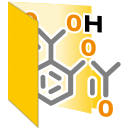
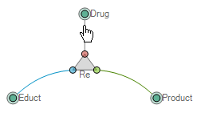
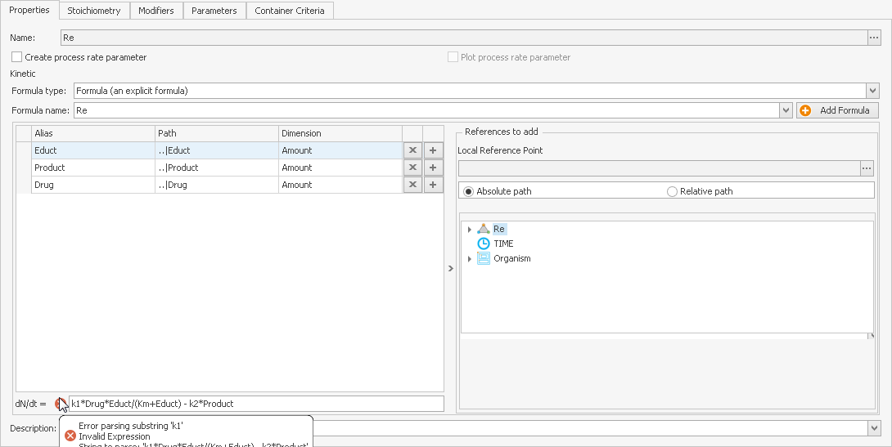
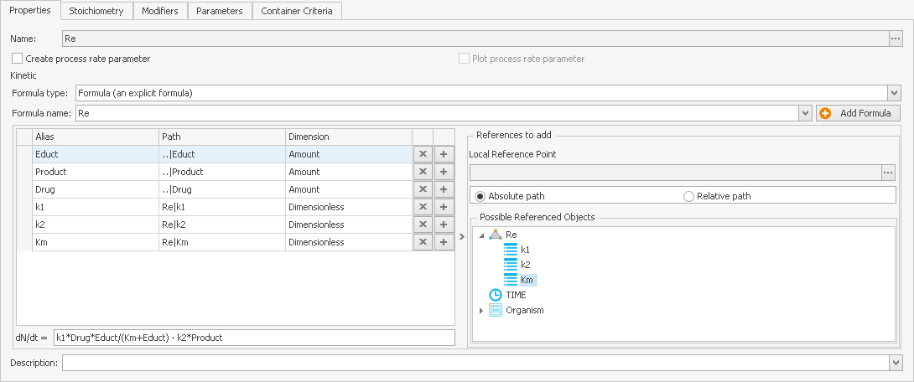
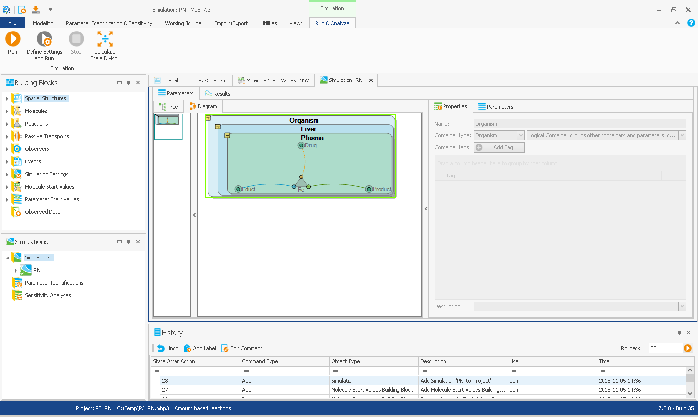
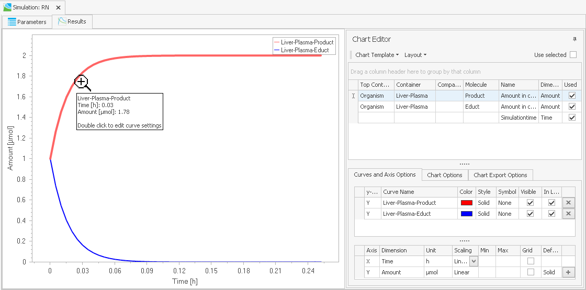

# Workflow - Setting Up a Reaction Network‌

This chapter will give a brief overview of:

*   how a simple reaction network is established within the building blocks

*   how different building blocks are combined to get a functioning network (simulation)

*   how a dynamic simulation of the newly established reaction network can be performed

This workflow will be described in detail below.

### Step 1: Create a new project:

*   Start MoBi®

*   Click on the **File** tab and select  **New Project** 

    or

*   Use the shortcut key **Ctrl+N**


Creating a new project automatically creates new building blocks for molecules, reactions, the spatial structure, passive transports, observers and events.


### Step 2: Open the new Molecules building block named "Molecules":

To open a building block, extend its tree view in the building block explorer and either:

*   Double-click on the appearing building block .

*   Right-click on the appearing building block and select  **Edit** from the context menu.

The building block is now opened in the main window and the ribbon view changed to the building block specific ribbon tab (Edit Molecules).

### Step 3: Create three new Molecules named "Educt", "Product" and "Drug":

*   Click  **New** in the building block specific ribbon tab or right-click on the empty space in the building block (_Molecule List Tree View_) in the main window and select  **Create Molecule**.

*   In the appearing window, select a name for the molecule and enter a **Constant** default start amount with the value set to 1 µmol.

*   Deselect the **Stationary** property (to indicate that the molecule is non- stationary) and click **OK**.

In the main window, the molecules building block should now contain three list entries named "Educt", "Product" and "Drug".

### Step 4: Create a container where the reaction takes place:

*   Open the "Organism" building block in the spacial structure building block group.

*   In the new main window, double-click on the green container in the diagram area named "Organism".

*   Select the **Properties** tab in the lower half of the main window and using the right combobox of **Container Type**. Select: _Logical Container ..._.

*   In the diagram area, right-click anywhere and select  **Refresh** in the context menu: the color of the green container named "Organism" should change to _blue_, which characterizes logical containers.

*   In the diagram area, right-click on the container named "Organism" and select  Create Container in the context menu.

*   In the appearing "New Container" window, choose a new name for the container (here: liver), set the **Container Type** to _Logical Container ..._, and click **OK**.

*   Right-click on the new "Liver" container. Again, create a new container named "Plasma" with **Container Type** set to _Physical Container ..._ and click **OK**.

*   Double-click on the new "Plasma" container. In the parameters tab below the diagram area click on the  **Add Parameter** button.

*   In the appearing "New Parameter" window, specify a name for the parameter (here: Volume), verify that the **Dimension** is set to _Volume_ and **Formula Type** to _Constant_, and set the Value to 1 liter.

### Step 5: Create a new reaction named "Re":

*   Open the reaction building block for editing.

*   To create a reaction, either click on  **New** in the building block specific ribbon tab or right-click on the empty space in the diagram area of the building block edit window and select  **Create Reaction**.

*   Add the molecules created in **Step 3**  by either clicking on  **Insert Molecule** in the building block specific ribbon tab or right-clicking on the diagram area of the building block edit window and select  **Insert Molecule**.

*   A new window appears: select the molecules displayed in the list (select all three while holding down the **Ctrl** key) and click **OK**.

To connect the molecule "Educt" as an educt of the reaction "Re", move the mouse to the edge of the molecule in the diagram area until the mouse cursor changes into a "Hand" symbol. . Click and drag your cursor towards the reaction until the appearing line snaps onto the _blue_ circle (the educt port) at the lower left end of the reaction symbol.

Repeat this procedure for the "Product" molecule and the _green_ circle at the lower right corner of the reaction symbol, and the "Drug" Molecule and the _red_ circle at the top of the reaction symbol.


The molecule "Drug" is now a modifier (as is indicated by the _red_ circle) of the reaction that is neither consumed nor produced by the reaction, but required (as all participating molecules) to be present at the same location (even if at concentration zero) for the reaction to be generated in the simulation creation process as described later in **Step 9**.


### Step 6: Specify the kinetics of the reaction:

To edit the reaction "Re" and define its kinetics:

*   Double-click on the reaction symbol in the diagram area;

*   or right-click on the reaction symbol in the diagram area and select  **Edit** from the context menu.

Select the properties tab in the window below the diagram area.


By default, all molecules are defined in the **Dimension** Amount. As reaction kinetics are computed from concentration values of reactants, volumes of the containers where reactions take place have to be taken into account.


We will now define the reaction kinetics as a reversible reaction in which the molecule "Educt" is:

*   consumed according to the _Michaelis-Menten_ rate law: _k1\*Drug/V\*((Educt/V)/ (Km+Educt/V))_

*   produced according to the mass action kinetics rate law: _k2*Product/V_

By default, the **Formula Type** of the kinetics is set to **Formula** (an explicit formula). You can change this selection by use of the combobox, if needed.

Now select the formula string input box to the right of the yellow warning sign with the exclamation mark  and enter the chosen reaction rate:

*   k1\*Drug/V\*((Educt/V)/(Km+Educt/V))-k2\*Product/V

The properties tab should now look like depicted below:


The color of the circles of the reaction symbol determines the sign of the kinetic formula. For molecules attached to the _blue_ circle (always the _educts_) it is negative as they are consumed. For molecules attached to the _green_ circle (always the _products_) it is positive as they are produced.


In the properties tab, two essential inputs are still missing:

*   An explicit formula requires a name as indicated by the symbol .

*   The specified formula cannot be parsed due to the unknown entities: _k1_, _k2_, _Km_ and _V_ as indicated by the symbol .

First, a new formula has to be created. To create a new formula, click on the  **Add Formula** button. A new window appears, where you can define a new name for the formula. Type in "r1" and confirm the name by clicking **OK**. The formula is also listed in the formula list in the formula tab located above the diagram area.

The yellow warning sign  indicates that the construction of our kinetic rate equation is not yet complete. To get a consistent formula, you need to assign the missing parameters to the reaction and add them to the referenced objects list.


As depicted above, molecules are automatically added to the referenced objects list of an _explicit Formula_ when connected to the reaction. The referenced objects are by default listed by the following properties:


_The table below belongs to note above._

|   |   |
|--- |--- |
| Alias | Defines the name by which the referenced objects are used in the Formula. If the name in the formula does not correspond to the Alias of the respective reference, a warning sign  appears. |
| Path | Path where the referenced object is located within the project. |
| Dimension | Dimension (e.g., _Volume_ l or _Concentration_ µmol/l) of the referenced object. |


Formulas are automatically stored _even if incomplete_! However, they can be completed any time later. A list of all formulas used in one building block can be found in the formulas tab next to the main tab of each building block in edit view.


### Step 7: Add new parameters:

Select the parameters tab next to the properties tab. To create a new parameter:

*   Click on the  **Add Parameter** button.

In the new window

*   Select a new name: _k1_, for the first rate constant.

*   Select **Parameter Type**: _Local_.

*   Using the combobox, set the **Dimension** to _InversedTime_.

*   Select the **Formula Type**: _Constant_.

*   Set a **Value**: 1 _1/min_.

Repeat the process for parameter _k2_. For parameter _Km_, select **Dimension**

Concentration and the Constant **Value** 1 µmol/l.

To add parameters to the reaction, go back to the properties tab. Go to the tree list "Possible Referenced Objects" on the right side of the window. The selected reaction "Re" should appear at the top of the tree. Extend the tree view of "Re". The parameters _k1_, _k2_ and _Km_ should be listed below "Re". To add the parameters to the list of referenced objects, drag & drop each parameter into the list to the left, where "Educt", "Product" and "Drug" are already listed.

To add the volume parameter "V" to the list, select the bullet Relative Path. A new window appears where you can select the local reference point. Extend the tree and navigate to _Organism|Liver_. Select "Plasma" and click **OK**. Now, navigate to the same point (_Organism|Liver|Plasma_) in the tree in the "Possible Referenced Objects" window and drag & drop "Volume" into the referenced objects list. Change the **Alias** of "Volume" to "V". Your properties tab should now look like depicted below.

### Step 8: Define start values:

Before we can create a simulation, we need to define start values. To create new molecule and parameter start values:

*   Right-click on the molecule start values building block group in the building block explorer and select  **Create Molecule Start Value Building Block** from the context menu.

*   In the appearing "Create new Start Values" window, define a name (here: "MSV") for the molecule start values building block and confirm by clicking **OK** .

*   Repeat the procedure for a new parameter start values building block using the name "PSV".

### Step 9: Create a Simulation from the newly defined building blocks:

Before we can simulate, the reactions network of a simulation has to be created from the building blocks. To create a simulation:

*   Click on  **Create** in the _Simulation_ Group the _Modeling & Simulation_ ribbon tab.

*   In the appearing "Simulation Creation Wizard" window, specify a name for the simulation. Here: "RN".

*   Confirm the simulation creation process by clicking **Finish** .

A new simulation "RN" is added to the simulations explorer and automatically opened in edit mode in the main window. Your MoBi® program user interface should now look like depicted in below.

### Step 10: Simulate the dynamics of the newly created simulation of "RN": To run the simulation we first need to adjust the simulation settings:

*   Select the Settings tab of the simulation in the main window.

*   In the top half of the Settings tab set the **EndTime** to 0.25 h and the **Resolution** to 600.00 pts/h.

Now we can run the simulation. To run the simulation, click  **Run** in the simulation group of the modeling & simulation ribbon.

To view the simulation results:

*   Select the **Results** tab of the simulation in the main window.

*   To the right of the window, click on or hover with your mouse over the autohidden chart editor view to slide out the chart editor.


You can permanently dock the chart editor by clicking on the "pin" icon . Undock the chart editor by again clicking on the icon .


To display the simulation results in a plot window:

*   Extend the tree "Organ: Liver" in the _Data Browser_ at the top of the chart editor, if it is not already open.

*   Select both checkboxes  in the column **Used**.

You can now see the simulation results in the plot, and your **Results** tab should now look as depicted below.

