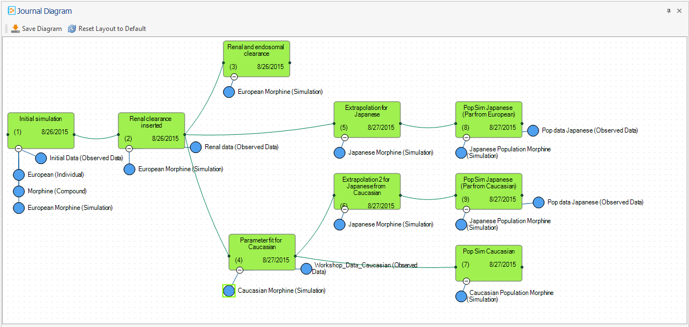

# Shared Tools - Working Journal

## Project Documentation‌

The Working Journal allows for easy documentation of your working process with the Open Systems Pharmacology Suite. Because building PBPK and PD models is often a complex process, a documentation is necessary

*   for the modeler to remember the model building process,

*   for people who take over a model,

*   for authorities who have to evaluate the quality of modelling results.

Although it is possible in principle to use any text editor to write a documentation, the Working Journal provides several features, which give additional benefit:

*   Integrated rich text editor with the essential formatting options,

*   Easy transfer of Open Systems Pharmacology Suite content to the Journal (tables, charts),

*   Storage of simulations or building blocks as attachments to Journal Pages which can later be compared to other simulations or even reloaded,

*   Fast full text search in the complete Journal,

*   Journal Diagram as graphical overview of the model building process,

A Working Journal can be shared among several PK-Sim and MoBi project files, so one unique journal can be used within your project even if you use different project files. Even different users can access the same Working Journal at the same time - but only one user can edit a Journal Page at a time. From the technical point of view, the Journal consists of a .sbj file which contains all content, attachments and meta information.

After each important workstep, intermediate results or decision points can and should be added a Journal Page to the Journal. This should include the result, the input values, and description of decisions.

For instance, the values of the favorite parameters and result charts can be copied into the Working Journal by copy & paste and corresponding simulations and building blocks can be attached to the Journal Page directly from the context menu.

## Overview‌

To access the Working Journal, select the Tab Working Journal. Most buttons are deactivated before having created or selected a Journal for the current project file.

To add the first Journal Page, click **Add Page**. You are asked, whether you want to open an existing Journal or to create a new one.

*   If you have already created a Journal for the project (NOT project file), click

Open and select the .sbj file.

*   Otherwise, click **Create** and select a location and enter a file name for the .sbj file.

A Text Editor opens, and here it is possible to

*   edit the Title of the Journal Page, which is also visible in the Journal View (see “Journal view”),

*   enter and format text like in other text editors (you can also insert pictures or symbols, create tables, use hyperlinks etc.),

*   tag your document with keywords, e.g. the project file name, which can later be used for filtering.

The Page is saved automatically, when closing the Editor or switching to another Page.

Additionally, you can save any time explicitly using the short cut CTRL-S or the corresponding button in the file menu.

### Journal view‌

On the right side of the PK-Sim or MoBi application, the **Journal view** is shown by default. You can show and hide it like other views. In case you have removed the view, you can reopen it by clicking the corresponding button  in the Tab **Views**.

By default, the Journal pages are ordered by the creation date in a descending order. For each page, the unique index, the title, creation date, tags and the first characters of the text are displayed. You can select other columns with the column chooser to display for example the userid of the author. You can use the columns for sorting, filtering and grouping. This is helpful in particular in large projects, where different authors contributed or different project files are used.

To open a Journal Page in the Editor or to bring the Editor on top of the other windows, just double click on the corresponding Journal Page row. Alternatively, you can use the context menu (by right click) to edit or delete a Journal Page.

With a single click on a Journal Page row, you activate the Journal Page without bringing the Editor on top.

At the bottom of the **Journal View**, some detail information is displayed for the selected Journal Page, in particular a list of related items, if you have attached e.g. simulations or building blocks.

### Journal Ribbon group‌

After you had selected a Working Journal for your project file, all buttons in the Journal Ribbon group are active.

In the following sections we describe the available functions.

#### Add Page
    
A new Journal Page is created and displayed in the Journal Editor. Changes in the previously edited Journal Page are stored.

#### Journal Editor
    
The Journal Editor is opened on top of other windows, if you have closed or hidden the Journal Editor. Only one Journal Editor window is open at the same time.

#### Search
    
The search area is opened in the Journal view. See “Searching the Journal” for more information about searching in Working Journal.

#### Export Journal
    
The currently filtered subset of Journal Pages in the Journal View is exported to a .docx Document. This function allows you to export the complete Journal or a subset. If you would like to distinguish between public and internal Journal pages, you can use corresponding tags for example.
    
#### Refresh Journal
    
The current changes in the Journal Editor are saved and displayed in the Journal view. Moreover, changes in the Working Journal made by other users are reflected in the Journal view. Keep in mind that a Working Journal can be shared by different project files and so different users can use the same Working Journal simultaneously.
    
#### Select Journal
    
A file selection dialog is opened, which allows you to select another Working Journal .sbj file. This is usually not necessary, only in case you have selected the wrong Working Journal before.

## Adding content to a Journal page‌

Besides manually entering content into a Journal page, you can copy and paste tables and charts from PK-Sim or MoBi. So you can for example copy the

Favorites table and the simulation chart within seconds to a Journal page and in this way document input and output of your model.


It is recommended to select all parameters under consideration as **Favorites** and to document the source of all parameter values changed from the default in the column **Value Description**. This ensures a comprehensive overview of the essential input of your simulation which you can document by copying just the Favorites table.


### Copy & paste of tables‌
    
You can copy tables or selection of rows to a Journal Page.

In both cases only the visible rows and columns are copied. So you can use the sorting and filtering features of the table to restrict the transferred table content. You can also remove a column by just dragging the column header out of the table area.

To copy the visible table into the Working Journal, do the following:

1.  Right click into a row header (on the left of a row) and select
    
    *   Copy Table \- to copy the whole visible table - or
        
    *   Copy Selected Rows \- to copy all selected rows (you should have selected rows before by SHFT + Click or CTRL + Click)
        
2.  Switch to the Journal Editor, move the cursor to the intended position and select Paste from the context menu (by right click).
    
Alternatively, you can paste the tables also to other tools like Powerpoint® or Excel®.
    

    
Use short cuts for copy (CTRL+C for Selected Rows, SHFT+CTRL+C for whole table) and paste (CTRL+V).


### Copy & paste of charts‌
    
You can copy charts in standard size independent on the size of the application window. To define the chart size and also font sizes open in the **Chart Editor** the Tab **Chart Export Options** and define the properties.

To copy the chart into the Working Journal, do the following

1.  Right click into the chart area and select **Copy to Clipboard**.

2.  Switch to the Journal Editor, move the cursor to the intended position and select Paste from the context menu.

Alternatively you can paste the tables also to other tools like Powerpoint® .

## Working with Related Items‌

Additionally to the content written and copied in a Journal Page, you can attach Simulations and Building Blocks to a Journal Page as **Related Items** to save the current state of your work.

For example, you create a Journal Page to document the working state at some milestone presentation and attach the simulations used. Later, you can easily compare current simulations to those milestone simulations and identify differences. Or you can even reload the simulation in its old state and rerun it with a changed parameter value. (Reload of a simulation in MoBi results in loading missing Building blocks, too - in PK-Sim only the simulation itself is reloaded.)

To attach a Simulation or a Building Block to the active Journal Page, just select the context menu entry  **Add to Journal ...** at a Simulation or Building Block in the respective Explorer view.

The Simulation or Building Block is then displayed in the **Related Items** list at the bottom of the Journal view.

Using the icons on the right of a **Related Item** you can

*   compare the attached Simulation or Building Block to one of the current Simulations or Building Blocks of the project,

*   reload the attached Simulation or Building Block into the project using a unique name,

*   delete the **Related Item**.

## Searching the Journal‌

After you documented your project work using the Working Journal, you might want to use these "memories". To do so, you can use the meta data like Title, creation date or tags to find the Journal Page you are interested in. But often it is easier just to search for a specific keyword or phrase you used in your documentation.

To search for a word or phrase do the following:

1.  Click the  Search button in the tab **Working Journal** to open the Search area in the **Journal view**.
    
2.  Enter the phrase into the Search field (or select one previous search phrase from the list you get by clicking the  button at the right of the Search field). If necessary, open the Search Options by clicking the  button and select options.
    
3.  Click on the **Find** button.
    
4.  A list of Journal Pages which contain the search phrase is displayed. For each Page the matches are displayed in the context.
    
Double click on a Journal Page to open the Page in the Journal Editor - the **Find Dialog** of the Editor is displayed automatically; so you can browse through the find results in the Page. (A direct navigation from the match in the Journal view is not possible.)

Click the  button on the left of the Search field to close the search area.

## The Journal Diagram‌

The modelling process in PBPK/PD projects is often not straight forward but requires consideration of different alternatives and testing of several approaches. So the working process is mostly not represented appropriately by just a sequence of work status. Instead, it looks like a tree with several dead ends and one path to the final solution.

Using the **Journal Diagram**, you can visualize your working process in a more appropriate way to maintain an overview of complex projects. You can use this overview for yourself or export it to project reports or slides. You can also see the Journal Diagram as a "diagram of content" of your Working Journal.

You can find the Journal Diagram at the bottom of your PK-Sim or MoBi window. It is hidden by default. If you have removed the view, you can activate it using the button  Journal Diagram in the Tab Views. There is only one unique Journal Diagram per Working Journal.

The Journal Diagram displays green rectangular nodes for each Journal Page and blue circle nodes for each attached related item at a Journal Page. You can arrange the nodes as you like just by drag & drop. If you move a Journal Page node the connected Related Item nodes are moved, too.

The green links represent predecessor-successor (or parent-child) relations in your working process. While a Journal Page representing a work status can have several successor Journal Pages, it can have only one predecessor Journal Page.

To connect two Journal Pages, do the following:

1.  click on the right connection port,

2.  hold the mouse key and drag to a left connection port of another Page,

3.  release the mouse key.

To delete a connection, select it and press the DEL key.

After you have arranged the Journal Diagram, click the Save Diagram button  to save the Diagram layout to the Working Journal.


Clicking on Reset Layout to Default does immediately overwrite your layout work, so be careful using this button. (Result: All Journal Page nodes are displayed side by side in one horizontal sequence.)


You can zoom the diagram like all other diagrams by pressing the CTRL key while moving the mouse wheel.

By right click into the diagram area you get a context menu, which allows you to

*   **Copy to clipboard** the Journal Diagram (and paste it into other applications like Powerpoint® ,

*   Reset Zoom of the Journal Diagram,

*   Hide/Show Related Items to maintain the overview in large diagrams.