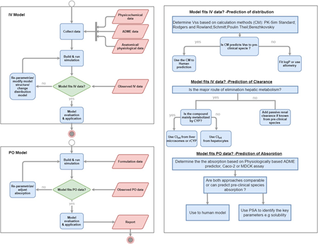

# Model Development

Prior to starting on model development, a requirements analysis should be conducted to assess and outline a model development strategy:
-	the model purpose, i.e. its context of use which should include
-	Organism / population characteristics (biometrics, genotype, disease state, …) and the 
-	Experimental design
-	the observed data  (e.g., QSA/PR, in-vitro, or in-vivo) available for model development
-	Non-clinical & clinical data considerations, e.g., would it help the model development of a human PBPK model to develop an animal PBPK model (e.g. for FIM or if no IV data was collected in humans but in animals)?
-	Individuals data vs population mean data: how will this impact model evaluation and qualification (variability and uncertainty assessments (Considered in Sections “3. Model Evaluation” and “4. Model Applications”)))
-	and the model evaluation & qualification strategy (Section “Model Evaluation”)

This requirements analysis should then be condensed into specifications (i.e., a strategy) for model development & qualification and documented within an analysis plan (see Figure1).

 

Figure 1: Predict, Learn, and Confirm cycle in IVIVE-PBPK model development (adopted from [[168](../references.md#168)]).   

Availability and quality of data for model development is the key element and has to be judged in the context of use (see “Useful Literature” below). 

**As an example:** data quality, e.g. input parameters for compound PK properties such as fraction unbound in plasma (fup) may have been precisely measured or only predicted with some uncertainty through QSPR models. The latter might contain too much uncertainty and not be appropriate in the context of precision dosing estimates for a clinical trial, but might well be suitable for risk assessment in environmental toxicology.

Thus, the key is to make yourself aware of the limitations of the available data considering:
-  accuracy and suitability of data for PBPK model development. 
-  in which systems the data have been collected 
   -  fu or lipophilicity measures (partitioning media used, neutral or acid/base compound)
   -  solubility (measured in water or biorelevant media)
   -  dissolution profiles (what apparatus was used and at which pH values).

What should not be neglected in the requirements analysis, is the evaluation of the information, data and structure which the PBPK framework and associated databases or “add-on modules” contain. Compound properties and context of use will require decisions and sound qualification on what to select from available options, e.g.: 
- which partitioning calculation method to choose based on compound properties 
- how to extend the model (with e.g. “add-on modules” found in modeling literature) if required to fulfill its purpose (i.e., customizing default model equations and structure to account for e.g. specific mechanisms of distribution or new organ compartments not covered by the default PBPK model structure).

## Useful Literature
- IVIVE / ADME [[159](../references.md#159)]
  -  This best practice provides an overview of strategies for first in human prediction based on preclinical modelling. A Review of relevant scientific publications and case examples are provided as well.
- Absorption [[160](../references.md#160)] 
  - This review provides an overview of the determinants of intestinal absorption and first-pass elimination of drugs and focuses on the principles and applications of conventional in vitro–in vivo extrapolation (IVIVE) methods to predict Fabs, FG, and FH in humans.
- Distribution [[161](../references.md#161)], [[162](../references.md#162)], [[163](../references.md#163)], [[164](../references.md#164)]
  - These papers provide the state of art of mechanistic calculation of steady state tissue:plasma partition coefficients (Kt:p) of organic chemicals in mammalian species was developed.
- Metabolism [[165](../references.md#165)]
  - Benet and Sodhi proposed future pathways that should be investigated in terms of the relationship to experimentally measured clearance values, rather than model-dependent intrinsic clearance
- Transporters & Excretion [[166](../references.md#166)], [[167](../references.md#167)]
  - These data demonstrate the promise of using IVIVE of transporter-mediated drug clearance and highlight the importance of quantifying plasma membrane expression of transporters and utilizing cells that mimic the in vivo mechanism(s) of transport of drugs.
- Data-driven model refinement and qualification (**TODO Add References e.g. [[124](../references.md#124)]**)
- PD Model?
  - Points to consider for target engagement/RO (add reference) and linking PBPK into QSP (add reference)
