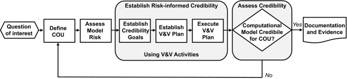

# Model Evaluation
1.	Get in the “Model Evaluation Mindset”:
    1. In your modeling analysis plan, define what questions you are planning to address with the model, i.e. -  the “context of use (COU)”.
    1. Consider the risk that exists if the model you choose leads to a biased or imprecise result. 
    1. Define performance requirements that the model will need to achieve for it to be a successful tool for addressing those questions (aka “model credibility”). Gear your model evaluation standards to enable you to determine whether or not your model has achieved the necessary performance requirements.
    1. Assess your model credibility as part of the model development. If a candidate model fails to meet requirements, continue to refine.
    1. Document evidence of credibility 

2.	Development of a **Credibility Assessment Framework** [[151](../references.md#151)]  can assist you in defining, conducting, and evaluating the model performance requirements.

    1. The Kuemmel et al 2020 paper provides rubrics, e.g., for establishing an assessment of model risk
    2. Consider, too, establishing more quantitative criteria for your model, as well. What level of error (MAE, RMSE, MRD, GMFE, ..., sensitivity to uncertainty in parameter values, etc) will be acceptable on which metrics (AUC, Cmax, and/or other). In some cases, for example, you may be able to tolerate a much larger-fold error (if it’s a rough projection of first-in-human dosing) compared with a case where a trial waiver is being considered, e.g., using a PBPK-based DDI projection. These goal posts will likely adjust in a manner consistent  with the risk score.
   
 

CPT: Pharmacometrics & Systems Pharmacology, Volume: 9, Issue: 1, Pages: 21-28, First published: 25 October 2019, DOI: (10.1002/psp4.12479)

3.	Goodness-of-fit diagnostics to consider during model development and for the final model evaluations include the following:
    1. Quantitative metrics of predictive performance for exposure endpoints of interest, 
        - e.g., half-life, Cmax and AUC
        - Precision and bias calculations: RMSE, mean absolute error (MAE), mean relative deviation (MRD) of the predicted plasma concentrations for all observed and the corresponding predicted plasma concentrations as well as geometric mean fold errors (GMFEs) 
    2. Graphics
        1. Overlay of observed and predicted concentration-time profiles. Depending on your focus (include plots on linear scale (e.g. focus on absorption and Cmax) and / or logarithmic scale (e.g. focus on Distribution and elimination)!). [[152](../references.md#152)], [[153](../references.md#153)]
        2. Observed vs predicted of derived metrics, e.g., Cmax and AUC [[152](../references.md#152)]
        3. Precision and bias metrics (e.g., MAE, RMSE) to compare across models or other methodological approaches [[153](../references.md#153)]
    3. Standards for Model Evaluation Metrics (Loisios-Konstantinidis, Cristofoletti, et al. 2020) (**TODO Rimmler et al. 2019 ref not found**),[1]
    4. Strategies for model development and evaluation
        1. Case-based strategies for different application scenarios [[154](../references.md#154)]

4.	Acknowledge parameter value sources and expectations of reliability.  Use sensitivity analyses to evaluate the impact that variability or uncertainty in those values might have on model performance:
    1. For evaluating, acknowledging, and identifying sources for parameter values, additional considerations include pedigree tables (https://opensource.nibr.com/xgx/Resources/Uncertainty_Assessment_Pedigree_Table.pdf), and similar approaches, e.g., 
        1. Braakman S, Paxson R, Tannenbaum S, Gulati A. Visualizing Parameter Source Reliability and Sensitivity for QSP Models. ACoP10 Oct 2019
        1. Gulati A, Tannenbaum S.  Using visualization to address the reliability of sources of initial parameter values in a Quantitative Systems Pharmacology (QSP) model.  ACoP9 October 2018
    1. PBPK and QSP modeling requires an understanding and acknowledgement of a priori (structural) and a posteriori (practical) identifiability, as well as characterization of uncertainty in the model parameters. Local and global sensitivity analyses can be used to quantify the influence of parameter variation on predictive performance. 
        1. A sampling of reviews that provide an overview of these techniques includes: [[155](../references.md#155)], [[156](../references.md#156)], [[157](../references.md#157)], [[158](../references.md#158)]
        1. An open-source example of global sensitivity (Sobol) analysis is available here: https://github.com/metrumresearchgroup/pbpk-qsp-mrgsolve/blob/master/docs/global_sensitivity_analysis.md 

5.	Documentation of the model development and evaluations should include evidence from the model credibility assessment. This also should include documentation of the planned and execution verification and validation, e.g., to cover these areas of the PBPK model development and evaluation: 
    1. Verification activities will ensure the correctness of implementation of model code and the accuracy of the underlying software and algorithms. Verification will be accomplished via test scripts, peer code reviews, built-in model sanity checks (e.g., PBPK mass-balance checks), etc. 
    1. Validation activities will ensure the accuracy of the overall model, the validity of model assumptions, and ability of the model to answer the specific questions of interest. Validation will be accomplished by comparison of model predictions with clinical data or other comparators.
