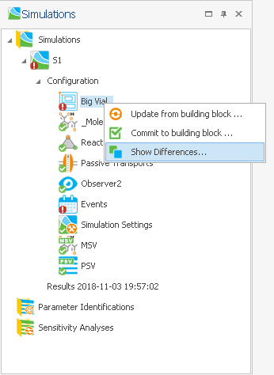

# Comparison of Building Blocks

The comparison of building blocks can help when to compare different versions of a model for e.g. reporting purposes. Alterations of individual building blocks can be seen at a glance. Converting models can also lead to alterations in building blocks. This can be the case, if one version of a model uses a functionality of PK- Sim® that was not available in the older version, e.g. tagging building blocks. A further, rather special case, is a listing of extended start values upon comparison. If, in MoBi® parameter or molecule start values are incomplete, they are extended during the **Create Simulation** process. These amended start values will be listed if the respective building block before and after creation of a simulation are compared.

Generally, only two building blocks can be compared at a time. Comparison of building blocks can be done within a group. For example, to compare two different molecule building blocks, press the Control key and mark both building block by left click. Upon right click, the context menu appears as shown below.

Comparison of building blocks can also be done within a simulation when a building has been altered and the differences to the original version need to be known. This is illustrated in the example shown below in which using the **Show differences** option in the context menue will produce a list of changes. Chosing the **Update from building block** option will reset all settings in the building block to those of the original.

Comparison of building blocks can also be done between two simulations on the same kind of building block as shown below.

Comparison of building blocks yields a list as shown below that can be filtered for better overview. To do so, right click on the small filter symbol in the top right hand corner of the row header and choose the filter setting from the context menue.

Comparison can be made according to specific settings defined by the user. The value entered for **Comparison tolerance \(relative\)** is a multiplication factor that sets the limit for two values being equal. For example, if this is set to 0, then two values need to be exactly the same for being considered equal. In contrast, setting the relative tolerance to 1, the values are considered equal. By default, the relative comparison tolerance is set to 1E-5. Using this setting, two values are equal if - in a first approximation - the first five digits after the decimal point are equal. The tolerance has no effect when comparing non-numerical values, like "present/ absent".

A derived parameter can be defined by a formula that uses other parameters. Choosing the option **By values**, numerical values in the formula or the output of the formula are compared. Here, no limit for being equal can be introduced and numerical values need to be identical for being considered equal. All numerical values that differ between the two building blocks are compared. Choosing the option **By formula** compares the structure of the formulas. Both comparison criteria can be limited to impacts on the results of the simulations that contains the compared building blocks.

