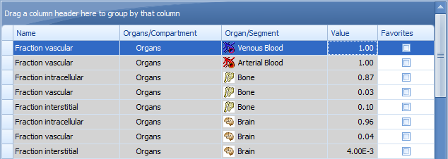
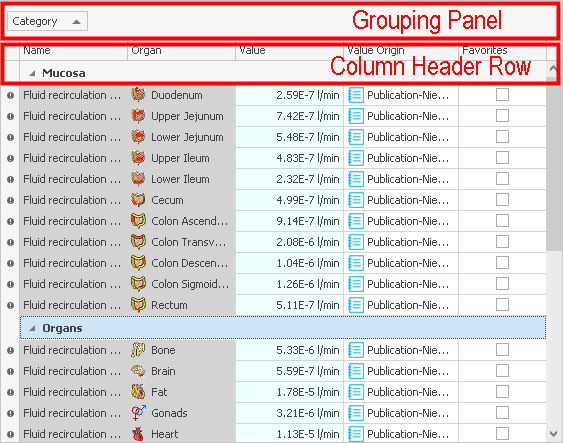

# Features of Tables

In this chapter you find the documentation of the table view, which is generally used throughout the Open Systems Pharmacology Suite.

## Overview‌

In PK-Sim® and MoBi®, tables are often used for input and output, for instance in parameter lists, history, and the chart editor. The tables have several useful features whose availability in some cases depends on the context.

In this section we describe the most important features on the example of the table **Physiology &gt; Organ composition** in the tab **Anatomy & Physiology** of an individual in PK-Sim®.

Before we describe the features in more detail in the following subsections, we give a brief overview of the most used concepts and actions:

* Column width - you can change the width of a column by dragging the separator line between two column headers .
* Column order - you can change the order of columns by dragging a column header to another location in the Column Header Row.
* Sorting - you can sort the rows by the content of a column by just clicking on the column header. The sorting column is marked by a triangle on the right of its header.
* Filtering - you can filter the rows by a certain value of a column by hovering with the mouse over the right hand side of the column header and clicking on the filter symbol , which then appears.
* Grouping - you can group the rows by dragging a column header to the grouping panel and vice versa.

Right-click on a column header to get a **context menu** with more features. In the following, we simply use **Context Menu** to denote the context menu of a column header.

The screenshot below shows a table

* grouped by the Organs/Compartment column,
* sorted by the Organ/Segment column,
* filtered by Name = 'Fraction vascular',
* and the name column moved left to the value column.

## Sorting‌

* To sort the rows of a table ascendingly by a column, click the column header.
* Click on the column header again to toggle the sort order between ascending and descending row values.
* Select **Clear Sorting** from **Context Menu** to undo the sorting.
* To sort by multiple columns, you need to press the shift key when clicking on the column headers for sorting. The ordering within a multiple column sort depends on the sequence with which the columns have been selected for sorting. To alter this sequence you deselect a column by **Clear Sorting** from **Context Menu** and then re-select it.

## Grouping‌

* To group the rows of a table by a column, drag the column header from the **Column Header Row** to the **Grouping Panel**, if visible, or select **Group by this column** from its **Context Menu**.
* To show the **Grouping Panel**, select **Show Group By Box** from **Context Menu**.
* You can group by several columns hierarchically. In order to do so drag a column header to the left or to the right of another column header in the **Grouping Panel**.
* To ungroup the rows, drag the corresponding column header from the **Grouping Panel** back into the **Column Header Row** or select **Ungroup** from the **Context Menu** in the **Grouping Panel**.


Note that the grouping feature is not available for all tables.


## Filtering‌

To filter the rows of a table do one of the following:

* Hover with the mouse over the right hand side of the column header and click the appearing filter symbol . Then select one or more values in the values list. The filter condition is displayed at the bottom of the table, where you can delete or edit it.
* Select **Show Auto Filter Row** from **Context Menu**. An auto filter row appears as first row in the table. There you can enter values; use \* as wildcard.
* Select **Filter Editor** from **Context Menu**. An filter editor dialog appears, where you can combine conditions for different columns.
* Select **Show Find Panel** from **Context Menu**. The find panel with a single search field appears above the **Grouping Panel**. Here you can enter some text and all rows of which any field contains that text are displayed.

You can easily combine different filter features, as exemplary shown in below.

## Select columns‌

* Select **Column Chooser** from **Context Menu**.
* Drag a column header from **Column Chooser** to **Column Header Row** to show the column.
* Drag a column header from **Column Header Row** to **Column Chooser** or outside the table to hide the column.


The column chooser is not available for organ composition table.


## Arrange columns‌

* You can change the order of columns by dragging a column header to another location in the **Column Header Row**.
* You can change the width of a column by dragging the separator line between two column headers .
* You can adjust the width of a single column to fit its contents by double clicking its column header.
* To automatically set an appropriate column width for all columns, select **Best Fit \(all columns\)** from **Context Menu**.

