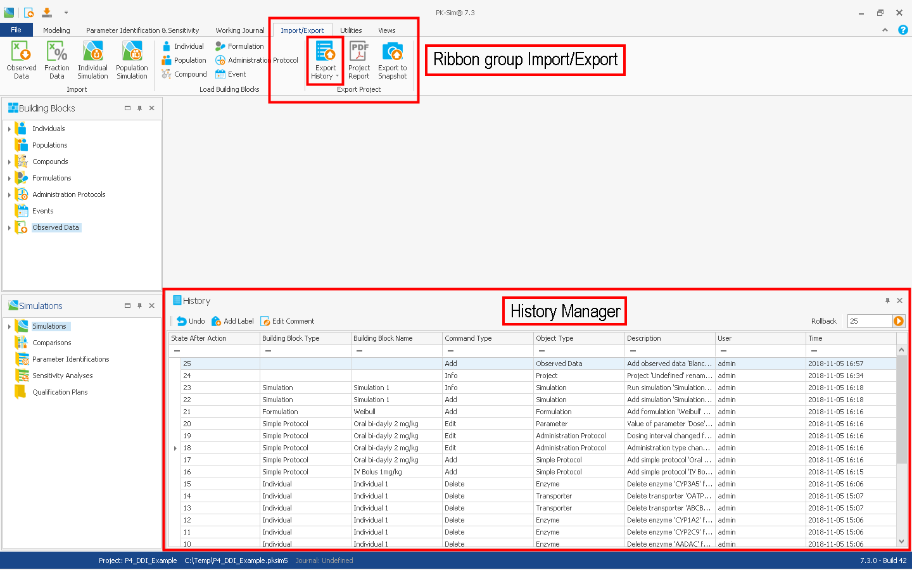

# History Manager and History Reporting‌

## Logging, undoing, and re-doing user actions‌

The history manager serves two purposes. On the one hand, it allows you to precisely log, and thereby document, all steps that lead to a particular result. This log can be saved to disk as an Excel® report. On the other hand, with the history available, the user can step back in the history to any previous state of the current session, and take that as starting point for a different direction in model development.

The history manager is available both in PK-Sim® and MoBi®, with only minor differences between the two programs. It is located at the lower part of the application window screenshot above. If it is not apparent, look for the little handle on the lower left corner which can be used, by hovering over, to pop up the history manager. Use the top right controls \(in this history window\) to make the history permanently visible. Other elements of relevance for interaction with the history are placed in the "Modeling & Simulation" ribbon as Buttons:

* Undo
* Add Label...
* Create Report

The history manager itself presents a table view of the history. Each line of the history describes a specific _state_ of the project that was arrived at after a user interaction. The topmost state in the list is the current state of the project. Each line has several columns that describe the state, with small differences between PK-Sim® and MoBi®:

### PK-Sim®

* State After Action: The number of the state of this history line
* Building Block Type: Which building block _type_ was affected by the associated action
* Building Block Name: Which building block name was affected by the associated action
* Command Type: The particular command of this state
* Object Type: A building block may be composed out of different objects, it is mentioned here which type was affected
* Description: What was done in this action. This columns deserves your main attention
* User: Since a project may be edited by several users, the user that caused this item is listed here
* Time: Date and time of the action

### MoBi®

* State After Action: The number of the state of this history line
* Command Type: The particular command of this state
* Object Type: An object type may be a building block, a reaction, a formula, or something else. Here, the particular object type that was affected is listed
* Description: What was done in this action. This columns deserves your main attention
* User: Since a project may be edited by several users, the user that caused this item is listed here
* Time: Date and time of the action


Like most tables in PK-Sim®, the history table view can be sorted and filtered by _any_ column. The column can be used for sorting by clicking on the column header. When hovering over the column header with the mouse, you can see a little funnel symbol: By clicking on the funnel a list with all entries in that particular column is shown. You can select one of the entries and the table will be filtered to show only rows containing that entry in the column.


The following sections describe the use of the history manager for a\) navigating in the project history, b\) adding labels and comments to the history, and c\) exporting the history as a report.

### Undo and rollback: Navigating through the history‌

As known from other applications, user interactions of the current session can be un-done:

The history manager has a "Rollback..." button and an associated numerical field. Within the history manager, the history list displays all previous user actions. You can select an entry in this list. The entry is numbered, and the number appears in the numerical field. You can click the "Rollback..." button, and this will undo all actions that were performed after the respective step and revert the state of the project to that numbered state.


Please note that by using the rollback function all intermediate steps will, nevertheless, be conserved and can be restored. However, in contrast to the undo functionality, simulation results will not be reconstructed and it is required to re-run the simulation.


PK-Sim® offers an additional way to achieve this:

The "Modeling & Simulation" ribbon has a ribbon group History that offers a button "Undo". By clicking this button, you undo the last action. A second click on this button will undo the undo - that is reverting to the original state.

### Labels and comments‌

At any stage, the current stage of the application can be labeled. The History Manager provides an button "Add Label...". When clicking on this button, an "Add Label..." window appears and allows you to add a label and a comment. This label will appear in the history manager and be time stamped with the current date and time. Labels are always applied to the _current_ state of the project.

In addition, the history manager provides an button, "Edit Comments". This can be used to add a comment to the currently selected entry of the history. If a comment already exists, it can be edited. Comments of a label can be edited as well.

In PK-Sim®, the "Add Label..." and "Edit Comments" functionality is additionally available as buttons in the "Modeling & Simulation" ribbon.

### Exporting the history‌

The "Modeling & Simulation" ribbon provides a "Export History" button. When clicking on this button and selecting "Export history to Excel®", a file save dialog appears. Please choose a location and name for the file. The file will be saved in Excel® format and opened in Excel® after saving is complete.

