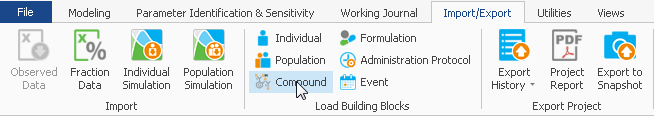
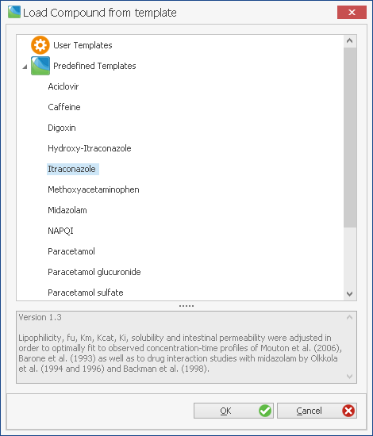
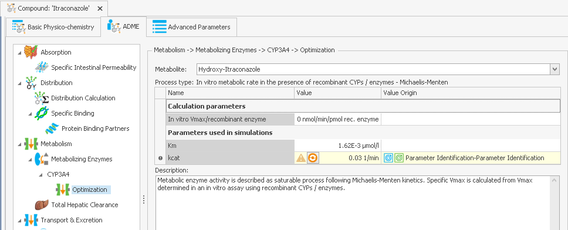
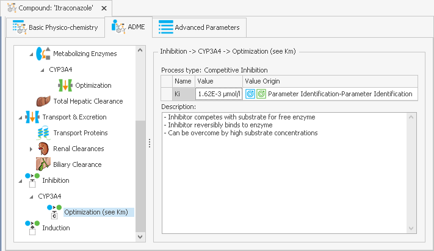
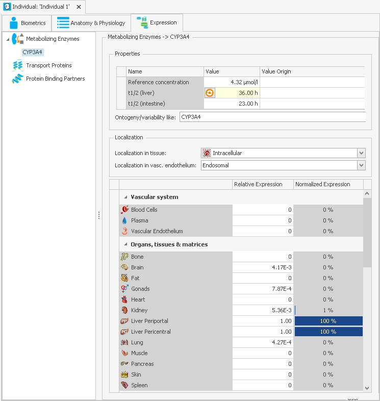
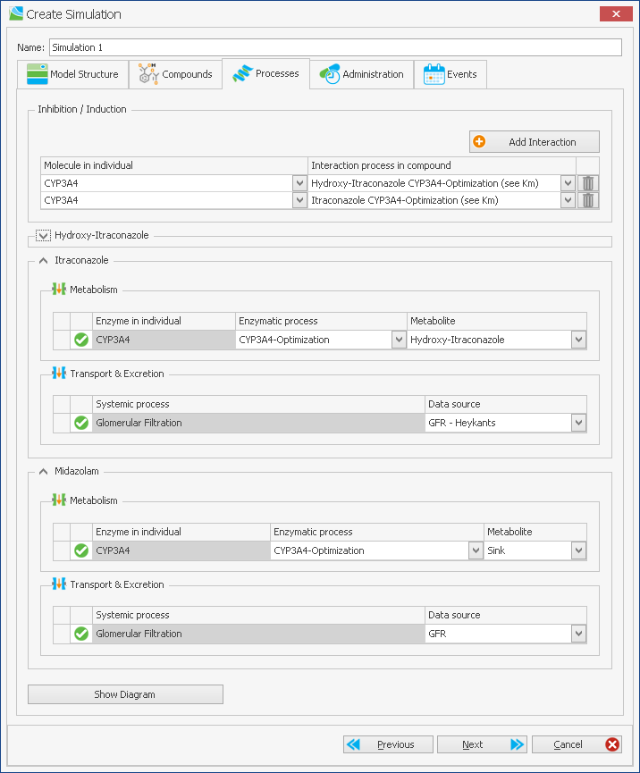
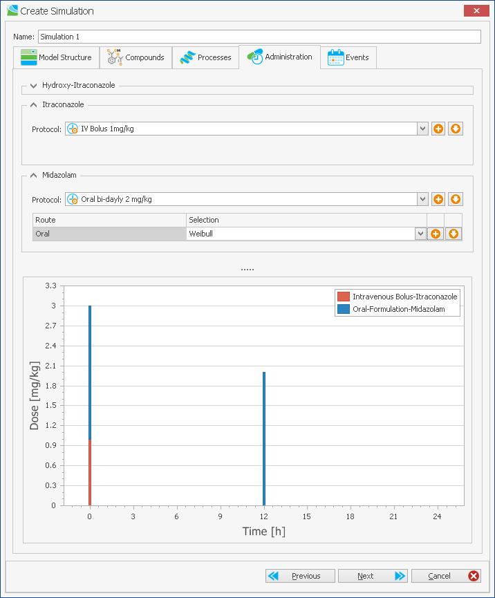
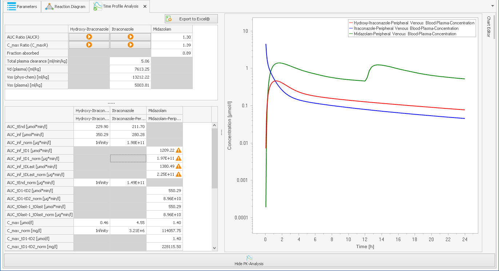
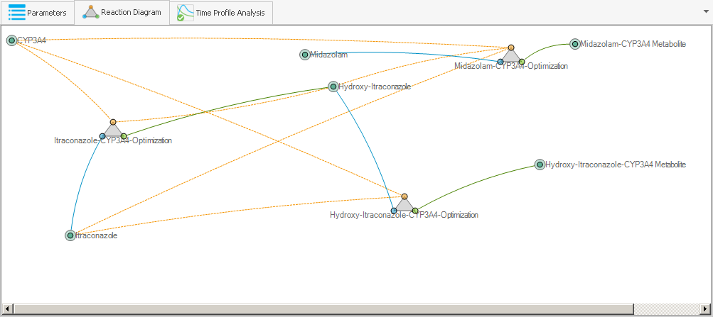

# Setting up a Drug-Drug Interaction in PK-Sim‌

Inhibition of a metabolizing enzyme or transporter by a drug can be defined directly in PK-Sim® in a simple and user-friendly manner. In the example workflow below, a drug-drug-interaction \(DDI\) model is set up using preconfigured templates compounds, e.g. the drug itraconazole, its metabolite hydroxy-itraconazole, and midazolam.

Load the predefined compound from templates into PK-Sim® by clicking on the **Compound** icon in the **Load Building Blocks** menu of the **Import/Export** tab.

In this case, the preconfigured itraconazole compound building block is imported.

In the predefined compound Itraconazole, Hydroxy-Itraconazole is already pre- specified as primary metabolite. However, users can make changes to all fields if desired and well-founded.

Process type and Ki values of the inhibition have already been pre-specified for the template compounds Itraconazole and Hydroxy-Itraconazole:

Next, expression levels of metabolizing enzymes can be added to the **Individual** building block to be used in the simulation:

Further building blocks can be defined in the respective sections and a simulation is then created by clicking on the **Create** button in the **Simulation** section in the **Modeling and Simulation** tab.

In the pre-configured compound templates, the inhibition processes for each enzyme or transporter are predefined, but can be adjusted by the user if applicable. Enzymes present in the **Individual** building block are matched with processes specified in the used **Compound** building blocks and metabolites are defined. Also, systemic processes regarding transport or excretion \(e.g. ‘Glomerular Filtration’ like in the example displayed here\) are shown and can be modified as desired.

In the next step, application protocols for each compound are defined using the available building blocks the user has configured before.

After having added and matched all building blocks required, the simulation is set up and can be run by either hitting F5 or using the **Run** button in the **Simulation** section of the **Modeling and Simulation** tab.

After running the simulation, all compounds and metabolites \(in this case Itraconazole, Hydroxy-Itraconazole and Midazolam\) can be plotted and the simulated PK data can be analyzed for each.

Also, at any given time after the simulation has been created, the simulated metabolic network that was defined can be displayed as a reaction diagram. Like in MoBi®, the blue dot of the reaction triangle connects to the educts of the reactions, the red dot to catalysts \(e.g. interacting substances, enzymes or transporters\) and the green dot to reaction products as shown below.

