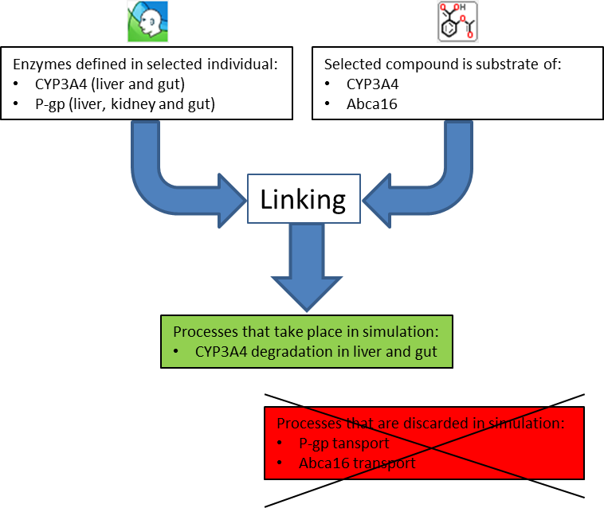
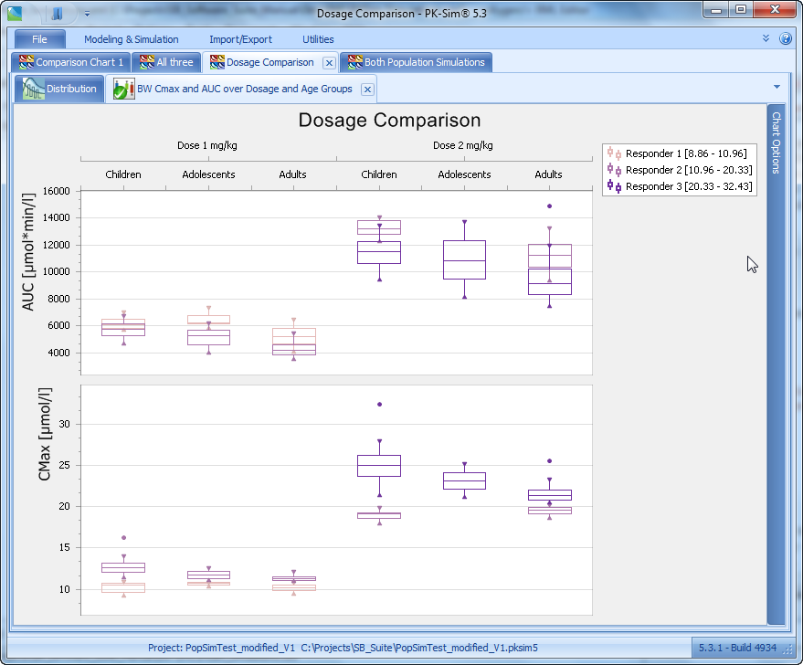

# Simulations

Simulations can easily be performed in PK-Sim® after having defined at least one building block for **Individuals**, **Compounds** and **Administration Protocols** in the **Building Block** panel. Optionally, populations, formulations, events and observed data may be defined. Details on these building blocks can be found in the respective sections of this manual:

* PK-Sim® - _Creating Individuals_
* PK-Sim® - Compounds: Definition and Work _Flows_
* PK-Sim® - Administration Protocols\_
* PK-Sim® - Creating Populations
* PK-Sim® - Formulations
* PK-Sim® - Events

Even if not all required building blocks are defined you may still set up a simulation. You will then be systematically led through each missing building block where you can specify data or parameters. For details on each building block please refer to the respective chapters of this manual.

Simulations are performed in 3 steps: Creating a simulation \(see [Creating new simulations in PK-Sim®](pk-sim-simulations.md#creating-new-simulations-in-pk-sim)\), running a simulation \(see [Running a simulation in an individual](pk-sim-simulations.md#running-a-simulation-in-an-individual)\) and displaying the results in the chart window \(see [Analyzing results for a simulation in an individual](pk-sim-simulations.md#analyzing-results-for-a-simulation-in-an-individual)\). Experimental data can also be imported in the chart window to enable comparison to the simulated results and to facilitate model refinement.

## Creating new simulations in PK-Sim®‌

To create a new simulation:

* Click **Create**  in the **Simulation** Group of the **Modeling & Simulation** Tab or
* Use the short cut **Ctrl+Alt+S**

In the **Create Simulation** dialog window the simulation is set up by specifying Individual or Population simulation, selecting a compound from a list and choosing the model settings:

In order to create a new simulation, you are guided through five tabs of the **Create Simulation** window:

* The **Model Structure** tab to define model properties
* The **Compound** tab to select the compounds used for the simulation
* The **Processes** tab to assign the relevant biological processes
* The **Application** tab to select between different predefined applications
* The **Events** tab to choose a specific event defined in the **Event** Building Block

### Definition of model structure‌

In the **Model Structure** tab of the **Create Simulation** window you need to:

• Enter a name for the simulation

• Specify an individual or population by doing one of the following:

• Select a previously defined individual or population from the drop-down menu

• Define a new individual or population by clicking **Create**  and follow the instructions of the dialog windows

• Load a new individual or population from template by clicking **Load**  and follow the instructions of the dialog windows

**Allow aging**: If a human individual or population is selected the growth of the human individual\(s\) during the simulation time will be taken into account when5 choosing this option. Based on the human growth and maturation functions available for most parameters in PK-Sim® \(e.g. organ volumes, blood flow rates, organ composition, etc.\) the parameters are updated along the time scale of the simulation. This is important for multiple drug administration to

e.g. preterm and term neonates, for which the rapid changes in anatomical and physiological properties can influence the pharmacokinetics during the simulated study circle. Please note that the use of the growth function will need additional simulation time so that it is recommended to use this option only if really needed.

* Specify a compound by doing one of the following:
* Select a compound from the list of previously created compounds in the Building Block window.
* Create a new compound by clicking **Create**  and follow the instructions in the dialog windows.
* Load a new compound from template by clicking **Load**  and follow the instructions in the dialog windows.
* Select the model settings, i.e. either select the standard model for small molecules or the model for proteins and large molecules

#### Model settings‌

| Model Settings | Description |
| :--- | :--- |
| Standard model for small molecules | The PK-Sim® standard distribution model assumes 4 subcompartments per organ, i.e. compartments for blood cells, plasma, interstitial space, and cellular space. This model type considers a permeation barrier between plasma and interstitial space and takes into account that the interstitial space has a lower protein content than the plasma. It is especially suitable for small molecules.  The plasma-interstitial partition coefficients result from the lower protein concentration in the interstitial space compared to plasma and the unbound fraction in plasma. It is assumed, that the drug has the same affinity to plasma as to interstitial proteins. Thus, effects from the partitioning between plasma and interstitial space may \(depending on other physico- chemical data\) become important for compounds with a low fraction unbound.  The rate of permeation through the endothelial barrier between plasma and interstitial space is determined by the product of endothelial permeability and surface area. The drug dependent permeability can be defined within the Distribution Tab and the individual dependent surface area can be defined for the individual. In the present version of PK-Sim®, the endothelial permeability parameters of the plasma-interstitial barriers are not calculated from physico-chemical compound data. The default value for the plasma-interstitial permeabilities is very large, i.e. the permeabilities have to be adjusted manually, if the permeation across the plasma-interstitial barriers of the organs is expected to be restricted. Using the large default value for plasma-interstitial permeabilities, the exchange rate between plasma and interstitial in 4 subcompartments model are almost instantaneous. |
| Model for proteins and large molecules | This model type was developed to simulate the pharmacokinetics of macromolecules such as therapeutic proteins. It is an extension of the standard model for small molecules and contains a description of the transcapillary drug exchange, lymph flows and an additional sub-compartment per organ that represents the endosomal space. The endosomal compartment contains FcRn receptors that are able to protect the macromolecules from catabolism via binding to these receptors \(important for e.g. IgG antibodies\). |


Please note that currently only for mouse, monkey and human species specific values for the concentration of the FcRn receptor, the concentration of the endogenous IgG and the affinity of the endogenous IgG to the FcRn receptor \(needed for the **Model for proteins and large molecules**\) are available. In case of all other animal species just reasonable values are used as physiological default values.


### Review compound settings‌

In the **Compounds** tab of the **Create Simulation** window you can review the _Calculation methods_ selected for the partition coefficients and the cellular permeabilities. Also, you can review and override values for the _Parameter Alternatives_.

Click **Next** in order to assign the relevant biological processes. Note that you can switch between the **Tabbed view** and the **Accordion View** in the **Utilities/ Options** menu if you selected more than one compound.

### Select relevant biological processes‌

In the **Processes** tab of the **Create Simulation** window, processes like e.g. metabolic, transport, excretion and specific binding processes defined in the selected individual \(or population\) can be linked to the ADME properties of the selected compounds. A detailed descripton of how to set up interaction of a drug with enzymes/transporters \(e.g. via a drug-drug interaction or induction\) can be found in PK-Sim®- Compounds: Defining inhibition/induction _processes_.


If, and only if, processes in individuals are linked to properties of the compounds, these processes are modeled in the simulation.



A green check mark indicates that the process is modeled when running the simulation whereas the yellow exclamation mark indicates that there is no match between the expression data defined in the individual and active processes defined in the compounds, as shown in the following screenshot.


Example 1: 

Example 2:

Renal excretion of the compounds should be incorporated into the model. The following settings are required for the selected individual \(the capability of renal excretion is a default setting\):

Add a renal clearance process for the selected compound in Compound → Biological processes → Transport & Excretion → Renal clearances, as exemplified in the following screenshot:

Link the process in the individual with the biological process of the compound \(if not yet automatically done\):


If you wish to simulate a renally impaired individual, decrease the GFR properties in the selected individual, not in the compounds!


Click on **Next** in order to assign an application to your simulation

### Select administration‌

In the **Administration** tab of the **Create Simulation** window, the administration protocol can be loaded from the project database or from a template. Further, a novel administration protocol can be defined and used. In addition, in the case of oral and user defined administration types, a formulation is required for the simulation.

To insert an administration do one of the following:

* Select a previously defined protocol from the **Administration Protocol** drop- down menu
* Define a new administration by clicking **Create**  and follow the instructions of the dialog windows
* Load an administration from the template data base by clicking **Load**  and follow the instructions of the dialog windows

In case of oral and user defined administration, you will have to additionally map the formulation\(s\) defined in the **Formulation** building block. In case of sophisticated dosing schedules, different formulations can be chosen for the various administration times. For an intravenous administration \(Intravenous Bolus and Intravenous Infusion\), the definition of a formulation name is not necessary, because the drug is always assumed to be given in solution. For these administration types, therefore, no match with formulations has to be made. For further information please see _PK-Sim® - Administration Protocols_


None or exactly one administration protocol can be assigned to every compound used in the simulation. Each administration protocol can be assigned to maximally one compound.


### Select events \(optional\)‌

In the **Events** tab of the **Create Simulation** window, events such as the administration of meals and/or discrete gallbladder emptying can be defined at various points of the simulation.

Events are optional for creating a simulation. Possible predefined events are currently the application of a meal to simulate fed conditions for an oral administration and gallbladder emptying independent from meal administration. To insert an event do one of the following:

* Select a previously defined event from the **Event** drop-down menu
* Define a new event by clicking **Create**  and follow the instructions of the appearing dialog windows
* Load an event from the template data base by clicking  and follow the instructions of the appearing dialog windows

Click **OK**  to finish the **Create Simulation** process and to close the window.

If you have successfully created a simulation, it will appear in the simulation window with its name and its components:


The green check marks indicate that the building blocks used in the simulation have the same settings as the original building blocks saved in the building block explorer window. Changing the settings in the simulation is done locally without affecting the original building blocks in the building block explorer window.


## How to set up a parent/metabolite simulation‌

From version 5.6.2 onwards, PK-Sim® offers two alternatives to define drug metabolites. First, metabolites can be a "sink" which means that not actively or passively transported. They possess no physico-chemical or ADME properties and cannot be used as compounds in a simulation. Second, one of the compounds in a simulation can be assigned to be a metabolite or another compound. The metabolite possesses physico-chemical and ADME properties and be transported. In addition, the metabolite can be used in further metabolizations and thus a metabolic network can be built.

If you want the compound not be treated as sink, it needs to be included into the list of compounds in the building blocks.

If you click on **Show Diagram**, a reaction network of all reactions in the simulation is shown \(not just the metabolic network\).

## Running a simulation in an individual‌

If a simulation was successfully created, press the **Run** simulation button  in the Modeling & Simulation ribbon or press the F5 key. If the simulation is run for the first time, ths following window will appear in which the simulation curves that will be generated in the simulation can be selected:

Per default, the peripheral venous blood plasma is already selected. If desired, select further outputs and then press **OK**. The result of the individual simulation will be automatically displayed.

In order to select another or additional outputs for the current simulation, click on **Define Settings and Run** simulation button.


By clicking **Save Settings into...** at the bottom left corner of the **Curve Selection window** the settings can be saved as a default for the project or as a user-specific default.


Two venous blood outputs can be selected: “Venous Blood” and “Peripheral Venous Blood”. “Venous Blood” refers to the compartment “Venous Blood” representing the large veins. In clinical practice it is common to sample blood at patients superficial veins, e.g. the antecubital vein. Therefore, PK-Sim® offers the opportunity to also display the pharmacokinetics of the drug in the peripheral venous plasma in order to allow a more accurate description of clinical data. Per default “Peripheral Venous Blood” is a weighted mean of skin and muscle tissue blood \(about 70% contribution from skin and about 30% contribution from muscle for all species\). You can change the default contribution to “Peripheral Venous Blood” by adjusting the parameters “Fraction of peripheral blood flow in organ” at “Physiology” -&gt; “Flow Rates” -&gt; “Peripheral Blood Flow Fraction” \(select “Advanced” view for parameters\). The contributions can be defined for arterial blood, bone, fat, muscle, and skin, i.e. all compartments which could possibly contribute to “Peripheral Venous Blood”. The arterial plasma is also considered because of the arteriovenous anastomoses in e.g. the skin of the hand \(shunts between arteries and veins involved in the regulation of body temperature\). A similar approach to describe peripheral venous plasma concentrations can be found in literature \[41\].


As the observer for peripheral venous blood sampling represents a balanced mixture of plasma concentrations of the drug in arterial blood, bone, fat, muscle, and skin please do not use the peripheral venous blood observer in the case of e.g. subcutaneous or intramuscular drug administration. This will lead to an overestimation of the concentration in plasma.


For general information about the chart component, i.e. chart settings and options etc., please see [Chart Component](../../shared-tools-and-example-workflows/chart-component.md).


If you would like to cancel the running process, press the **Stop** button next to the **Run** button.


If you wish to change the settings of the simulation, click on the **Parameters** tab. If you have simulated a population, there are two more tabs **User Defined Variability** and **Distribution** in which the settings also might be changed. For both, individual and population simulations, there are three views on the parameter settings to select at the bottom of the window:

* Simple view: in this view, not all parameters are displayed
* Advanced view: all parameters are displayed
* Hierarchy view: all parameters are displayed as located in the spatial model structure

You may change the parameter settings for your simulation in order to e.g. achieve a better fit to the observed data. The settings in the building blocks will be unaffected.


It is recommended to select all parameters under consideration as **Favorites** and to document the source of all parameter values changed from the default in the column **Value Description**. Then you have a comprehensive overview about the essential input of your simulation, which you can document by copying just the Favorites table.



If you change the parameter settings in the **Parameter** tab, the green check marks \(traffic lights\) on the Results tab will turn red indicating that the displayed simulation results were not performed with the current settings:  
   
 Press the **Run** simulation button in the **Modeling & Simulation** ribbon or press the **F5** key again to re-run the simulation with the current settings and display the results.



If parameter settings were changed in the simulation, the red traffic lights in the **Simulation** window indicate that the **local settings** in the simulation are different from the settings in the **Building Block**, i.e. the **global settings**:  
   
A right click on the red traffic lights in the simulation window allows for two possibilities:  
   
  _Update from building block: The simulation settings \(local\) will be updated with the \(global\) settings of the building block. This is useful if you want to discard the settings of your simulation and get back to the original settings defined in the building block._  
 __ Commit to building block: The \(local\) settings of the simulation will be committed to the building block \(global settings\). This is useful if you want to make these settings available in other simulations.  
 \* Configure: Instead of updating a single building block within your simulation you can also Configure the entire simulation and update or exchange several building blocks at a time. To do so, right mouse click on the simulation and select Configure. The Create Simulation dialog will open where you can exchange the parameters and building blocks of your simulation. In the case of building blocks for which changes were made in the simulation, the name will be supplemented by the warning This is not the template building block!. To update the settings of the simulation select the appropriate building block from the drop-down menu.


## Analyzing results for a simulation in an individual‌

As described in the previous chapter **Run simulation**, clicking on **Run** in the **Modeling & Simulation** ribbon or pressing **F5** starts the calculation of the simulation. The results will be automatically displayed after finishing the calculation. The calculated results can the be exported to various file formats.


For more information on displaying and editing the charts, see [Chart Component](../../shared-tools-and-example-workflows/chart-component.md)

For more information on uploading observed data, see [Import and Edit of Observed Data](../../shared-tools-and-example-workflows/import-edit-observed-data.md)


Generally, two different views are available and switching between these view can be done by clicking on **Show PK-Analysis** and **Show Chart** button on the bottom of the chart window:

* Chart view  \(default\): The simulated curves and the observed data are displayed
* PK-Analysis view : The calculated PK parameters for the selected simulated curves are displayed.

### Chart view‌

The simulated curves can be displayed. If simulated curves selected in the curve selection window are missing after \(re-\)running a simulation, most probably these are not selected in the chart. The graphs can be selected by clicking on **Chart Editor** on the right hand side of the chart. Curve options, axis options and chart options can be selected here and the general layout of the chart can be configured.


For more information on displaying and editing the chart Display, go to [Chart Component](../../shared-tools-and-example-workflows/chart-component.md)


For comparison, observed data in MS Excel® format \(\*.xls and \*.xlsx\) can be loaded and displayed in the chart as well. If observed data were added to the **Observed Data** Building Block, they can be added to the chart by dragging and dropping them onto the chart.


For more information on how to load observed data and compare them to your simulated data, go to [Import and Edit of Observed Data](../../shared-tools-and-example-workflows/import-edit-observed-data.md)


Multiple results windows

If you wish to display different curves or use different settings for the same simulation, you can add new results charts windows by clicking on the **Results** button  in the Ribbon group **Simulation**.

Special features for population simulations

If you wish to display other percentiles or other curves without simulating again, click on the **Results** button  in the ribbon group **Simulation**. You will be directed to the **Curve selection for chart** window \(see above\).

### PK-Analysis view‌

If a simulation has been successfully created, click **Show PK-Analysis** on the bottom of the chart window. PK parameters are then calculated and displayed next to the chart.

The calculated pharmacokinetic parameters are:

1. In all simulations:

| PK parameter | Description |
| :--- | :--- |
| AUC\_tEnd | Area under curve from tstart to tend of the simulation.   |
| AUC\_inf | Area under curve extrapolated to infinity \(using the terminal 10% of data points\).   , where \# is the terminal elimination rate \(calculated from the terminal 10% of simulated points\). |
| %AUC\(tlast-inf\) | Percentage of AUCinf after end of simulation time.   |
| AUC\_tEnd\_norm | Area under curve extrapolated to infinity and normalized to the dose dose in drug mass per body weight.   |
| AUC\_inf\_norm | Area under curve extrapolated to infinity and normalized to the dose \[dose in drug mass per body weight\].   |
| AUC Ratio \(AUCR\) | AUC\_I/AUC \(Area under the plasma concentration-time curve of the substrate in the presence of the inhibitor / Area under the plasma concentration-time curve of the substrate in the absence of the inhibitor\) |
| C\_max | Maximum concentration |
| C\_max\_norm | Maximum concentration normalized to dose dose in drug mass per body weight |
| C\_max Ratio \(Cmax\_R\) | C\_max\_I/C\_max \(Maximum concentration of the plasma concentration-time curve of the substrate in the presence of the inhibitor / Maximum concentration of the plasma concentration-time curve of the substrate in the absence of the inhibitor\) |
| C\_tEnd | concentration at the end of simulation |
| t\_max | Time at which the maximum concentration is assumed |
| Half-Life | Terminal half life time \(calculated from the terminal 10% of data points\).    , where \# is the terminal elimination rate \(calculated from the terminal 10% of simulated points\). |
| MRT | Mean residence time is calculated by:  The infusion time is set to 0 for non intravenous administrations. The AUMCs are calculated according to:    , where \# is the terminal elimination rate \(calculated from the terminal 10% of simulated points\). |

\|

1. In simulations with intravenous administration:

| PK parameter | Description |
| :--- | :--- |
| VSS\(plasma\) | Volume of distribution at steady state calculated from the plasma curve according to:   |
| Vd\(plasma\) | Apparent volume of distribution is calculated from the plasma curve according to:  , where \# is the terminal elimination rate \(calculated from the terminal 10% of simulated points\). If simulation time is short, the distribution volume may be incorrect. Run a longer simulation \(to approach steady state\) and reevaluate the distribution volume. |
| Vss\(phys-chem\) | Predicted volume of distribution = Volume-weighted mean organ to plasma partition coefficient calculated from physico- chemical compound data. |
| Total plasma clearance CL | Total clearance calculated from plasma curve according to:    |
| Total body clearance | D/AUC - Total body clearance of drug or apparent clearance \(CL/F for extravascular application\), dimension is ml/min/kg |

1. In simulations with oral administration

| PK parameter | Description |
| :--- | :--- |
| Vss\(plasma\)/F | Volume of distribution at steady state calculated from plasma curve \(see above\) divided by bioavailability |
| Vd\(plasma\)/F | Apparent volume of distribution calculated from the plasma curve according to  \(see above\) divided by bioavailability |
| Total plasma clearance/F | Total clearance calculated from plasma curve according to   divided by bioavailability |
| Fraction absorbed | Absorbed fraction of applied oral dose. Please note that, e.g. in the case of enterohepatic circulation, this fraction may exceed 1 |
| Bioavailability | The bioavailability is only calculated on request. After pressing the button **Bioavailability** a second simulation with an intravenous \(i.v.\) short infusion is carried out \(internally without being displayed\) using identical parameters to the last simulation with oral \(p.o.\) administration. The bioavailability is then calculated from AUCinf \(p.o.\)/AUCinf \(i.v.\) in the venous blood compartment. For a proper estimate of the AUCinf \(p.o.\) it is recommended to simulate as long as total gastrointestinal transit takes. After changing any parameter the results of previously run simulations are no longer valid. In such a situation, the **Bioavailability** button is deactivated until the p.o. simulation has been executed with the current parameters. |

1. In simulations with multiple administrations

| PK parameter | Description |
| :--- | :--- |
| AUC\_inf\_tD1 | Area under the concentration vs. time curve from the first data point extrapolated to infinity \(further administrations are not considered!\) |
| AUC\_inf\_tD1\_n | oArmrea under the concentration vs. time curve from the first data point extrapolated to infinity \(further administrations are not considered!\) normalized to dose, with dose in drug mass per body weight |
| ....tDi-tDj | Respective PK parameter from the administration time of the first dose until the administration time of the second dose |
| ....tDlast-tDEnd | Respective PK parameter following the last application |
| ....tDlast-1- tDlast | Respective PK parameter in the intervall between the \(last -1\) application and the last application |
| C\_trough\_dDi | Trough concentration just before the i-th dose is administered |
| C\_trough\_dlast | Trough concentration just before the last dose is administered |

All values are calculated using the standard equations for PK-values \(see e.g. M. Rowland, T. N. Tozer, “Clinical Pharmacokinetic Concepts and Applications”, \(1994\) Lippincott Williams & Wilkins, Philadelphia\). For extrapolation to infinity an exponential function is used on the basis of the last 10% of the calculated time steps. AUC is calculated by extrapolating the first time steps to t = 0. Depending on the curve shape the result of this extrapolation may be sensitive to time resolution. This may lead to some variability in AUC and thus, in clearance and distribution volumes.

By clicking on **Export to Excel**®**...** the calculated PK-parameters \(including the simulated concentration-time profiles\) can be exported to MS Excel® format.

## Running and analyzing a population simulation‌

### The population simulation analysis‌

PK-Sim® version 5.3 offers a completely redesigned population simulation analysis that is both extremely flexible and user friendly. This new module is directly integrated in PK-Sim® and does not rely on the Matlab®-based toolbox of MoBi® to run as in previous versions. The original first step of choosing the organ and compartment in which time profiles and PK-parameters will be simulated did not change. The new analysis function offers a variety of analyses and graphical displays: Time Profile, Box Whisker, Scatter and Range Analysis that will be explained in detail in the following sections of the manual.

### Running a population simulation‌

Unlike for simulations in single individuals, additional variability for parameters in population simulations may be defined. In the **User Defined Variability** tab, parameters from all building blocks that need to be varied may be selected and specific distributions/variabilities can be set. In the **Distribution** tab, these settings are graphically visualized.


For more information on adding variability to a defined population, go to PK-Sim® - Creating Populations.


Once all parameters are set, click the **Run** simulation button  in the **Modeling & Simulation** group or press the **F5** key. The **Population Simulation Settings window: Curve selection** window will appear in which organs and compartments are selected in which time profiles and PK-parameters will be calculated.

Choose the organ and the compartment by expanding the respective drop-down menue and select by ticking the box in the right column of the table. Press **OK** to start the simulation run.

By clicking into the **Save Settings** at the bottom left corner of the **Curve Selection window** the settings can be saved as user-specific default.

### Analyzing a population simulation‌

After the simulation has been calculated, the **Create Time Profile Analysis** window opens up next in which the graphical display of simulated time profiles can be specified. If you do not want to plot time profiles, close this window and choose the analysis type you require from the **Analysis** button.

For plotting time profiles, use the **Output** tab to specify in which of the previously selected organs/compartment you want to analyze and plot time profiles. Highlight the respective organ/compartment and add it to the right panel. In the panel below, the **Outputs: Select distribution statistics for display**, you may specify which statistical quantity of your output will be graphically displayed.


You may change the name, the unit and the scaling of selected output in all plot types. Changing the name may be useful when graphically displaying several parameters and the parameter name is printed along the y-axis.



The calculated PK-parameters of all individual curves can be exported using the **Export PK-Analyses to CSV...** item from the context menu of the simulation.



The underlying data of population analysis can be exported to Excel® using the **Export to Excel**®**...** item from the context menu of the chart view. Two sheets are created containing the data as original and transposed matrix.


#### Definition of groupings

Output may be grouped using population parameters and PK-parameters. The **Population Parameters** tab offers grouping by population parameters e.g. Characteristics of individual \(weight, age, etc.\), anatomy or physiology. A comprehensive list itemizes each PK-parameter in the organs/compartments specified in the **Outputs** tab. In order to select a parameter as a grouping criterion, expand the tree underlying each group of criteria and use the **Add** or **Remove**button to add or remove a specific grouping PK-Parameter to the right panel. Highlight the respective grouping and click on the **Create Grouping** button to specify the grouping intervals \(binning\).

For PK-parameters with numerical values like C\_max or AUC grouping can be done into equally sized intervals using the **User defined limits**. Alternatively, grouping by numerical PK-parameters can be done into equally populated intervals of varying size using the **User defined \(equally populated\) number of bins**. For PK-parameters that assume string values like gender or race grouping is defined by **Value mapping**. Groupings have to be named and the name of the grouping appears later on as an item in the list of grouping parameters.

**User defined limits**

Grouping by customized intervals is available in both the **Population Parameter** and the **PK-Parameter** tabs. If you decide on defining the limits of each bin, the minimum and maximum values of your grouping criterion are automatically entered in the table listing the grouping intervals.

Continue as follows:

* Define the maximum value of the first bin.
* Add additional bins by clicking on the **+** button in the right column of the table that lists the binning intervals.
* In your last bin, the upper limit of you last bin is the maximum value of the parameter.
* For each interval, select a label and change color and symbol \(used in scatter plots\) by changing default settings.

**User defined \(equally populated\) number of bins**

If you decide on using equally populated bins for grouping of your output, labels for the individual bins have to be designed for the display.

In the **Label Generation** panel, do the following:

* Decide on the number of bins used for grouping.
* Choose from the drop-down menu a symbol that will be used in a scatter plot.
* Choose a start and end color for plotting the output in the first and the last interval. The color gradient in between is set automatically. Colors in individual intervals can be changed in the **Generated Label** panel below.
* Individual intervals are named using the selected **Naming pattern** that can be customized. Per default it consists of the selected **Template** e.g. alphabetic or numerical labelling together with the lower and upper limit of the interval. However, any of these elements may be omitted. More information on customizing the label generation are available directly within the software.


When you finish defining the grouping intervals, the grouping appears in the list of selected parameters. If you highlight a specific grouping, the lower panel of the **Population Parameters** and the **PK-Parameters** shows the distribution of the individuals of the population when stratified by this grouping along with the label of each bin.


**Value mapping for string parameters**

Population parameters such as gender, race and population name can be grouped by their string values. This grouping can be used to customize labels e.g. F or M instead of Female or Male and/or the relative order of these labels in the analysis \(i.e. which label should come first\) menu serves the design of customized labels.

#### The Time Profile Analysis

In the **Time Profile** tab, concentration-time profiles or fraction-time profiles can be plotted. First, in the **Selected Outputs** window, select from list of previously specified organs/compartments the concentration-/fraction-time profile\(s\) that you want to plot. Please note that concentration and fraction cannot be used at the same time for a given analysis. Second, if you want to display by grouping, select from the **Available Fields** panel a grouping criterion specified in the **Population Parameters** or the **PK-Parameters**.

There are several ways to visualize stratified results:

* If you drag a grouping criterion into the **Panes** panel, time-profiles in each subgroup will be displayed in a separate panel on the right. More than one grouping criterion may be selected and the respective number of panels will be generated.
* If you drag a grouping criterion into the **Colors** panel, time-profiles in each subgroup will be displayed in one color. Colors were previously selected in the **Outputs** window. Only one grouping criterion may be selected here, to be able to differentiate the subgroups.
* If you want to display results grouped by two criteria, use the **Panes** and the **Colors** panels simultaneously. In this case, it may wise to select only one output because curves from different compartments can only be differentiated by their progression.

For each curve PK parameters are calculated and can be shown by clicking on the **Show PK-Analysis** button.

* Chart view  \(default\): The calculated curves and the observed data are displayed
* PK-Analysis view : The calculated PK parameters for the selected calculated curves are displayed. See “PK- Analysis view”.

If you hover over the simulated time-profiles, details of the curve are displayed, e.g. the organ/compartment in which the time-profile was simulated, the statistical quantity that is plotted and the x- and y-values of the underlying data points.

Details of your grouping can be changed:

* Go back to the **Population Parameters** or the **PK-Parameters** tab.
* Highlight the name of the grouping in the panel listing the selected parameters.
* Right mouse click on the name of the grouping and select **Edit** from the menu.
* Confirm and close the window by clicking **OK** 


Use the magnifying glass to zoom into an area that you wish to enlarge.



Use the magnifying glass to zoom into an area that you wish to enlarge.


#### Displaying Observed Data in the Time Profile Analysis

In order to display **Observed Data** in your Time Profile Analysis do and note the following:

* Drag and drop the observed data from the Building Block panel into the Analysis panel.
* Either display specific files or folders of observed data in the building block.
* Use the **Chart Options** to specify the settings for display of the observed data.
* When observed data is displayed for the first time, it appears in all analysis panels by default.
* In the Chart Options, observed data can be grouped by meta data and is displayed in the respective panel. To apply the grouping also to the observed data the meta data field of the observed data must be named like the field in the analysis and the value must match.
* Once observed data is dragged into the analysis panel, it is associated to that simulation and can be removed by removing the observed data from the simulation tree.


For comparison charts observed data can not be removed from the analysis, but only made invisible by unticking the **Visible** box in the Chart Options.


#### The Box Whisker Analysis

In contrast to the Time Profile Analysis, population parameters and PK- parameters serve not only as grouping criteria in the Box Whisker Analysis, but may also be plotted. Any parameter selected in the **Population Parameters** tab and **PK-Parameters** tab is listed in the **Selected Outputs** panel of the **Box Whisker Plot** tab. Select a parameter for plotting by ticking the respective box. Grouping criteria are defined as described above and can be selected from the **Available Fields**. For grouping along the x-axis, several criteria may be selected by dragging to the **X-Grouping** panel. Grouping by color may be used for one criterion only and a corresponding legend is automatically created. The box comprises 25% \(lower rim\) to 75% \(upper rim\) of the values. The whiskers extend from 2.5% to 97.5% of the values in the population. The distance between the lower and upper box rim is called the inner quartile range \(IQR\). Outliers are values which lie outside the range from lower whisker limit - 1.5 time IQR to upper whisker limit + 1.5 time IQR.

A separate panel is created for each of the selected output parameters in the graphical display. The name and unit of the output parameters is printed along the Y-axis.

#### The Scatter Plot Analysis

In the **Scatter Plot Analysis** population parameters and PK-parameters can also be used as grouping criteria and be plotted. Grouping criteria are defined as described above. In addition to grouping in different panes or by different colors, you can group your output by symbols. Do so by dragging a grouping criterion into the **Symbols** panel. The symbols need to be defined along with the other grouping criteria in the **Population Parameter** or **PK-Parameter** tab.

#### The Range Plot Analysis

Similar to the **Scatter Plot Analysis**, the **Range Plot Analysis** offers continuous plotting of parameters on both axis. Grouping by **Population Parameters** and/or **PK-Parameters** is done as decribed above. The range plot displays the median of the parameter as a thick line and the parameter range that comprises 5-95% of individuals of the population.

Details of your analysis can be changed by right mouse click into the plot and selecting **Edit**.

### Cloning a Simulation‌

In certain cases, it can be helpful to clone a simulation, e.g. in order to keep all parameters defined in the simulation, such as the partition coefficient method, and exchange only one particular building block, e.g. the administration protocol. This can easily be done by cloning an existing simulation and subsequently exchanging the respective building block using the **Configure** functionality \(see above\).

To clone a simulation in the project:

1. Right mouse click on the respective simulation in the Simulations Explorer
2. Select **Clone...** 
3. The **Cloning Simulation dialog**, which is identical to the **Create Simulation dialog** for new simulations, will open. You will have to enter an alternative name for the simulation clone.
4. You can now go through the **Cloning Simulation dialog** and exchange parameters and/or entire building blocks of your simulation clone. To update the settings of the simulation select the appropriate building block from the drop-down menus.
5. Once all parameters and building blocks are appropriate confirm and close the window by clicking **OK** 


Please note that a simulation can only be cloned if the local simulation settings are in agreement with the global settings of the building blocks, as indicated by **green check marks**.


### Comparison chart for individual or population simulations in one plot‌

The comparison chart function allows for comparison of results of different individual or population simulations in one plot.

To create a comparison plot for simulation in individuals proceed in the following way:

* Click on the **Comparison Chart** button  in the Ribbon group **Simulation** and select **For Individual Simulations**. A new entry in the Simulation window will appear, **Comparison Chart 1**.

* Open the comparison chart \(if not already open\). An empty chart will be displayed.
* Drag and drop the simulations you want to compare from the Simulation window into the empty comparison chart.

* Select the simulated curves you would like to display in the comparison chart.

* If desired, add observed data from the building block by drag and drop to the chart.


To rename a comparison chart, right mouse click on the respective summary chart in the Simulation window, select **Rename** and enter the new name of the chart.


In contrast to previous versions, PK-Sim® version 5.3 offers a comparison chart also for population simulations. To create a comparison plot for simulations in populations proceed in the following way:

* Click on the **Comparison Chart** button  in the Ribbon group **Simulation** and select **For Population Simulations**. A new window **Select simulations to use in comparison** opens up. Select the simulations you want to compare by ticking the respective boxes. In addition, you can select a population as a reference population and specify labeling, symbol and color for plotting.

* When you have approved your selection of the curves by clicking OK, the **Comparison chart** chart offers you to look at the distribution of population parameters in the set union of the populations.

* You can then select the analysis type for your comparison from the **Analysis** button and then proceed with selection output and grouping criteria as secribed above.


For a comparison of populations, only the intersecting set of output appears, e.g. if you selected venous plasma concentrations as output in all populations, it appears in the list of **Outputs** in the time profile analysis tab.


If you define a population as a reference population, it will not be grouped into subpopulations. This might be useful when you want to compare variability in subgroups of one population with the variability of a reference population. This is illustrated below.

