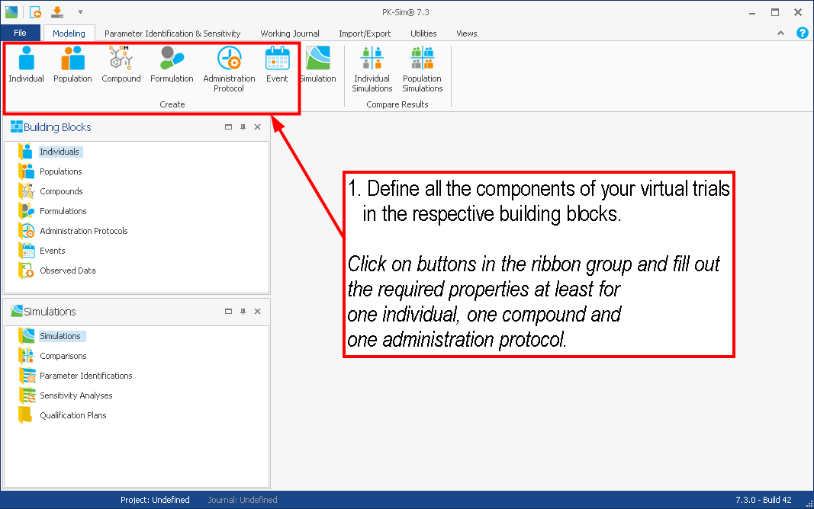

# Quick Guide‌

Here, only the basic steps needed to work with a PBPK simulation in PK-Sim® are briefly described \(creation of a model, comparison of simulation data to observed data and refinement of the model\):

